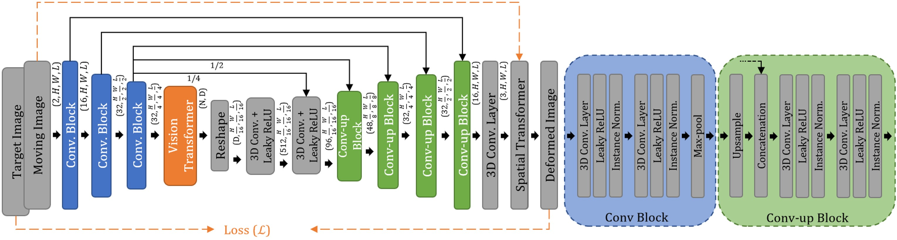
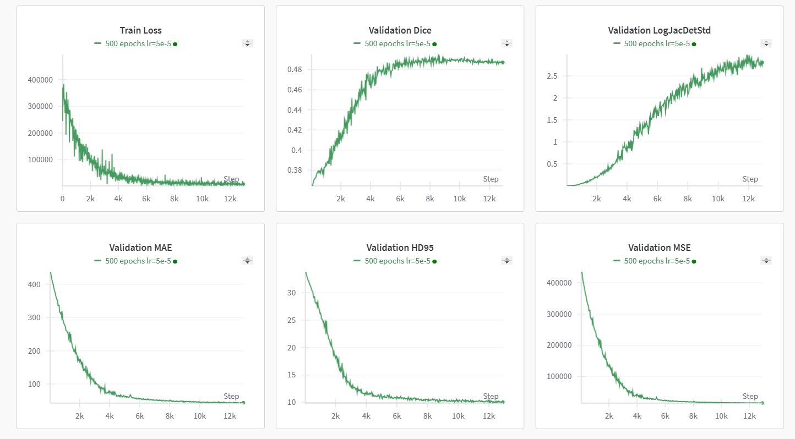

# AMS IZZIV - final report
AUTHOR: KRISTIAN FRANIĆ, 64170063

## ViT-V-Net 3D registration with Pytorch
PyTorch implementation of 3D CT image registration based on the short paper:
<a href="https://arxiv.org/abs/2104.06468">Chen, Junyu, et al. "ViT-V-Net: Vision Transformer for Unsupervised Volumetric Medical Image Registration. " Medical Imaging with Deep Learning (MIDL), 2021.</a>

Original github repository:
<a href="https://github.com/junyuchen245/ViT-V-Net_for_3D_Image_Registration_Pytorch">
https://github.com/junyuchen245/ViT-V-Net_for_3D_Image_Registration_Pytorch </a>

## Method Explanation
ConvNets are still limited by lacking the understanding of long-range spatial relations in an image. ViT for image classification uses a purely self-attention-based model that learns long-range spatial relations to focus on the relevant parts of an image. In this implementation,
ViT-based image segmentation methods have been combined with ConvNets to improve the recovery of detailed localization information.



- Extraction of high-level features with convolutional layers and downsampling (V-Net).

- ViT separates features into vectorised patches, followed by patch embedding
- Feeding patches into transformer encoder  (12x MSA & MLP)
- Output of ViT fed into decoding part of V-Net
- Loss function: MSE (mean squared error) + gradient regularizer 

In this project the ViT-V-Net model architecture was altered and upgraded to train a neural network model for CT->CBCT image registration tasks, as seen in the *OncoReg* challenge.

## Results
The model was successfully trained on the CT and CBCT images according to the proposed data split (cases 0000-0010 for training and cases 0011-0013 for validation/evaluation). 

The results are shown for the training of 500 epochs with a learning rate of 0.00005. The batch size was 1, with implemented gradient accumulation resulting in effective batch size 4. Optimization is performed with adaptive moment estimation (Adam). The loss function consisted of *MSE* and gradient regularization with the weights set to [1, 0.1] respectively.

Visualization  of the results is done with the Weights and Biases (wandb) module. The training/validation results show convergence of training loss and other parameters such as *Dice Score*, *HD95*, *MAE*, *MSE* and *LogJacDetStd*. 



After successful training, the resulting model was used to compute deformation fields as requested in the <a href="https://gitlab.lst.fe.uni-lj.si/domenP/deformable-registration">https://gitlab.lst.fe.uni-lj.si/domenP/deformable-registration</a> repository. Evaluation was then performed by calling the *evaluation.py* function with the command:
```bash
docker run \
    --rm \
    -u $UID:$UID \
    -v ./input:/input \
    -v ./output:/output/ \
    gitlab.lst.fe.uni-lj.si:5050/domenp/deformable-registration \
    python evaluation.py -v
```
The script produced results for the computed deformation fields with the following metrics:

```bash
 aggregated_results:
    LogJacDetStd     : 6.76067 +- 0.59191 | 30%: 6.98135
    TRE_kp           : 18.86106 +- 4.82604 | 30%: 22.02126
    TRE_lm           : 15.37277 +- 6.23210 | 30%: 16.65647
    DSC              : 0.20093 +- 0.04748 | 30%: 0.18527
    HD95             : 49.34553 +- 9.78324 | 30%: 40.81217
```
The results show that while there is some degree of consistency in the transformation (*LogJacDetStd* and the *TRE metrics*), the registration quality (as measured by *DSC* and *HD95*) could be significantly improved.

*DSC performance:*
Adjusting the loss function or registration algorithm could improve the overlap.
Incorporating additional features or better preprocessing could help with alignment.
Exploring more robust registration methods (e.g., using mutual information in combination with other losses) could improve the registration quality.

*Improvement areas:*
Enhancing the registration quality, possibly by refining the alignment procedure or optimizing the registration loss function, could help.
Reducing the *TRE* (both on keypoints and landmarks) could be achieved by focusing on more accurate landmark detection or keypoint alignment.

## Docker Information
*Step 1 (CT data)*: After downloading the repository into a desired folder, navigate to the project folder and run the command:
```bash
wget https://cloud.imi.uni-luebeck.de/s/xQPEy4sDDnHsmNg/download/ThoraxCBCT_OncoRegRelease_06_12_23.zip
unzip ThoraxCBCT_OncoRegRelease_06_12_23.zip
rm -r __MACOSX/
rm ThoraxCBCT_OncoRegRelease_06_12_23.zip
```
This will download the train/test/val data into the *'Release_06_12_23'* folder inside the project folder.

For testing (saving deformation fields from model) you will also need to create an empty folder with the name *'evaluation_def_fields'* Alternatively you can create a custom folder and change the *output_directory* in the main function of the *test.py* script.

*Step 2:* Build and run the docker image using *Dockerfile.torch.cuda* with:
```bash
docker build -t image-name -f Dockerfile.torch.cuda .
```
```bash
docker run -it --rm -v ./evaluation_def_fields:/app/evaluation_def_fields -v ./ViT-V-Net:/app/ViT-V-Net -v ./Release_06_12_23:/app/Release_06_12_23 --runtime=nvidia image-name bash
```
This command opens the bash terminal inside the docker container, allowing folder navigation and running scripts separately.

## Data Preparation
There were no special methods used to prepare the data before testing, outside of applying a rotational transformation on the moving images (applied automatically inside the training script):
```bash
    # Data Augmentation
    train_composed = transforms.Compose([
        trans.RandomFlip(0),
        trans.NumpyType((np.float32, np.float32)),
    ])
    val_composed = transforms.Compose([
        trans.Seg_norm(),
        trans.NumpyType((np.float32, np.int16)),
    ])
```
The folder structure inside *Release_06_12_23* is meant to remain as is to ensure the code handles the data correctly.

## Train Commands

After successully running the docker image with the command:
```bash
docker run -it --rm -v ./evaluation_def_fields:/app/evaluation_def_fields -v ./ViT-V-Net:/app/ViT-V-Net -v ./Release_06_12_23:/app/Release_06_12_23 --runtime=nvidia image-name bash
```
run the training script through the bash terminal using:
```bash
python ViT-V-Net/train.py
```
The terminal will prompt the user to perform a wandb login. After that training will continue for the desired epoch duration. 
The tuning of hyperparameters such as loss function weights, epoch numbers etc. can be done by changing the respective values inside the *main* function of the `train.py` script.


## Test Commands
Run the docker image with the same command as for training and call the function inside the container:
```bash
python ViT-V-Net/test.py
```
The script produces deformation fields for the evaluation script based on the trained model. The trained model is already available in the directory "/ViT-V-Net/Pretrained_models/Vitvnet500metric_0.486.pth". To use a different model, change the `model_path ` directory in the *main* function of the `test.py` script.

After saving the deformation fields, the model can be evaluated by using the following command in the terminal:
```bash
docker run     --rm     -u $UID:$UID    -v ./project_folder/evaluation_def_fields:/input     -v ./project_folder/testing_results:/output/     gitlab.lst.fe.uni-lj.si:5050/domenp/deformable-registration     python evaluation.py -v
```
(making sure that the appropriate input and output directories are mounted)
